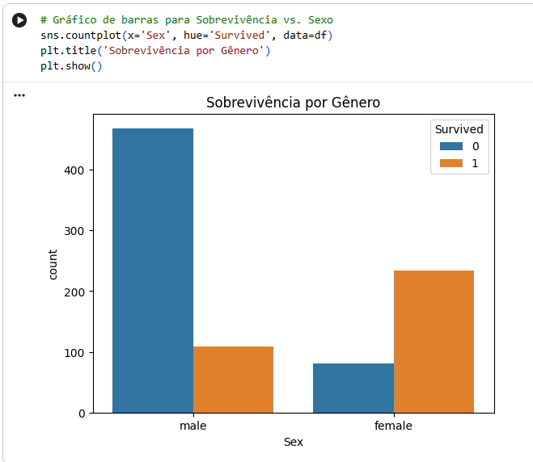

# 📌 Relatório de Experimentação em Aprendizagem de Máquina (Titanic)

## 1. Objetivo do Trabalho e Identificação

O projeto tem como objetivo principal aplicar um fluxo completo de Data Science (EDA, Pré-processamento e Modelagem) para resolver um problema de Classificação Binária. Utilizamos o dataset do Titanic para investigar e prever as chances de sobrevivência de passageiros com base em características demográficas e de viagem. O modelo de Árvore de Decisão foi selecionado pela sua alta interpretabilidade e facilidade de aplicação.  

---

## 👥 Integrantes

- André Henrique da Silva — RA: 851001  
- João Gustavo Pires Da Costa — RA: 2419919 
- Leonardo Elias Figueiredo — RA: 856987
- Luiz Gustavo Julio Salles - RA: 1449850
- Vinicius Azevedo de Ávila  — RA: 1048328

---

## 2. 🔗 Dataset Utilizado

- **NOME DO DATASET:** Titanic - Machine Learning from Disaster  
- **LINK (KAGGLE):** https://www.kaggle.com/c/titanic  
- **DESCRIÇÃO DO DATASET:** 891 amostras (passageiros) e 12 variáveis (colunas), incluindo informações como idade, sexo, classe de bilhete, tarifa e porto de embarque. O problema é de Classificação Binária.  
- **VARIÁVEL-ALVO (TARGET):** Survived (Sobrevivência: 1 para Sim, 0 para Não).  
- **JUSTIFICATIVA DA ESCOLHA:** O dataset é ideal para iniciantes em Machine Learning, pois possui uma estrutura clara, variáveis fáceis de interpretar e permite o uso de um modelo simples como a Árvore de Decisão sem exigir técnicas complexas de pré-processamento. 

---

## 3. 🧠 Modelo de Aprendizagem de Máquina

**Árvore de Decisão**  

 A Árvore de Decisão é um modelo de aprendizado supervisionado utilizado tanto para **regressão** quanto para **classificação**. Neste projeto, ele é usado para **classificar** se um **passageiro sobreviveu ou não.** 

 Foi escolhido por sua ***simplicidade** e **interpretabilidade.** O modelo não exige padronização de variáveis e permite visualizar a hierarquia das decisões, facilitando a compreensão de quais features (variáveis) são mais importantes na previsão.

 O modelo cria uma estrutura de fluxograma. Ele divide o conjunto de dados sequencialmente em nós (**decisões**) baseados na feature que melhor separa as classes (**Survived=1 e Survived=0**). O processo continua até que os grupos fiquem o mais "puros" possível, resultando em "folhas" que contêm a **previsão final.**

---

## 4. 📊 Análise Exploratória dos Dados (EDA)

### 4.1 Estatísticas Descritivas e Qualidade dos Dados

**Estatísticas Descritivas:** A taxa de sobrevivência média foi de **38%** , indicando que o desequilíbrio de classes é moderado. A idade média dos passageiros era de aproximadamente **29.7 anos.**

**Valores Ausentes:** As colunas **Cabin** (muitos nulos), **Age** e **Embarked** apresentaram valores faltantes, que foram **tratados.**


### 4.2 Visualização dos Dados e Padrões Relevantes

**Sexo:** A sobrevivência foi drasticamente maior para o gênero **feminino.** Este é o fator de **maior peso na previsão.**


**Classe da Passagem (Pclass):** Passageiros da 1ª classe tiveram a maior taxa de **sobrevivência**, enquanto a 3ª classe teve a menor. Isso indica uma correlação clara entre status socioeconômico e resgate.


---
## 5. Preparação dos Dados

### 5.1 Tratamento de Dados Ausentes
**Age:** Preenchida com a mediana (**28.0**) para manter a distribuição.

**Embarked:** Preenchida com a moda (**Porto 'S'**) devido à pequena quantidade de nulos.

### 5.2 Codificação de Variáveis Categóricas
**Codificação:** As variáveis categóricas (**Sex, Embarked, Pclass**) foram convertidas em formato numérico utilizando One-Hot Encoding **(pd.get_dummies**), criando colunas binárias (**Ex: Sex_male, Pclass_2**).

### 5.3 Padronização ou Normalização

**Padronização (StandardScaler):** **Não** foi necessária a aplicação de **Padronização**, pois o modelo escolhido (**Árvore de Decisão**) é baseado em **regras** e **divisões** e não em **distâncias**, sendo insensível à escala das features.

## 6. 🧪 Treinamento e Testes do Modelo
### Divisão dos Dados
Os dados foram divididos em conjuntos de Treino (**80%**) e Teste (**20%**) usando train_test_split(random_state=42).

O código completo do projeto, incluindo EDA, Pré-processamento, Treinamento e Métricas, está disponível no notebook.
Link para o notebook no Google Colab (Visualização): [https://colab.research.google.com/drive/1LL3bvcBt-LP3CKVsDM64p1XDHyH2Jy95?usp=sharing]

---

## 7. 📐 Métricas de Avaliação

Como o projeto utiliza um modelo de **Classificação Binária** (prever se o passageiro sobreviveu ou não), utilizamos as seguintes métricas para medir o desempenho do modelo no conjunto de teste:

### **Para Classificação**

**1. Accuracy (Acurácia)**

**O que é:** É a medida mais simples. Representa a proporção de todas as previsões que o modelo acertou (acertos totais dividido pelo número total de amostras).

 **Resultado:** O modelo final (Árvore de Profundidade=3) alcançou **79.89%** de **Acurácia.**

**2. Matriz de Confusão**

**O que é:** É uma tabela que mostra exatamente onde o modelo acertou e errou em cada classe. Ajuda a diferenciar os tipos de erros.

**Componentes e Explicação Intuitiva:**

True Positive (TP): O modelo disse que Sobreviveu, e estava Certo. (Acerto de sobreviventes)

True Negative (TN): O modelo disse que Não Sobreviveu, e estava Certo. (Acerto de não sobreviventes)

False Positive (FP): O modelo disse que Sobreviveu, mas o passageiro Não Sobreviveu. (Erro Tipo I: Falso Alarme)

False Negative (FN): O modelo disse que Não Sobreviveu, mas o passageiro Sobreviveu. (Erro Tipo II: Falha em detectar)

 **Resultado** (Exemplo do Exp. 1): O modelo acertou **81 previsões** de **não-sobrevivência** (TN) e **54 de sobrevivência** (TP).

**3. Precision (Precisão)**

**O que é:** Responde à pergunta: "Das vezes que o modelo previu 'Sobreviveu', quantas ele acertou de verdade?"

**Explicação Simples:** É importante quando você quer minimizar o Falso Positivo (FP). No contexto de um resgate, você quer que as pessoas que você aponta como sobreviventes realmente sejam sobreviventes.

 **Resultado** (Exp. 1): **71.05%**

**4. Recall (Sensibilidade)**

**O que é:** Responde à pergunta: "Dos passageiros que realmente sobreviveram, quantos o modelo conseguiu identificar corretamente?"

**Explicação Simples:** É importante quando você quer minimizar o Falso Negativo (FN). No contexto médico ou de segurança, você não quer deixar de detectar um caso positivo.

 **Resultado** (Exp. 1): **72.97%**

**Sobre Regressão:** As métricas de Regressão (**MAE, RMSE, R²**) **não** foram utilizadas neste projeto, pois o **problema** do Titanic é de **Classificação** (prever uma categoria: 0 ou 1). Essas métricas seriam aplicáveis se **estivéssemos prevendo um valor contínuo**, como a tarifa paga pelo passageiro.

---

## 8. 🧬 Experimentos Realizados

O grupo realizou três experimentos com a **Árvore de Decisão** (Decision Tree) para otimizar a performance, combater o **Overfitting** e avaliar a relevância das variáveis.

**Experimento 1: Modelo Baseline (Árvore de Profundidade Ilimitada)**

Este experimento estabeleceu a linha de base para comparação. O modelo foi treinado sem nenhuma restrição de complexidade (**max_depth=None, o padrão do Scikit-learn**).

**Métrica**	                    **Resultado**
Accuracy (Acurácia)	               76.54%

**Código e Interpretação**


**Interpretação:** Embora a acurácia seja aceitável, o resultado é comparativamente baixo para um modelo irrestrito, o que levantou a suspeita de **Overfitting** (o modelo memorizou os dados de treino e **falhou** em generalizar para os dados de teste).

**Experimento 2: Limitação da Profundidade da Árvore**

O objetivo foi combater o Overfitting restringindo a complexidade do modelo. Limitamos a profundidade máxima da árvore para max_depth=3.

**Métrica**	                    **Resultado**
Accuracy (Acurácia)                79.89% 

**Código e Interpretação**


**Interpretação:** A acurácia melhorou de **76.54%** para **79.89%.** Este ganho significativo confirma que o **Experimento 1** estava sobreajustado. Limitar o max_depth forçou a árvore a focar apenas nas features mais importantes (**Sexo, Classe**), resultando em um modelo mais robusto e com melhor capacidade de generalização.

**Experimento 3: Remoção da Variável Parch (Seleção de Features)**

Testamos se a remoção da variável Parch (**Número de Pais/Filhos a bordo**), que se mostrou pouco correlacionada na EDA, afetaria o desempenho do nosso melhor modelo (**max_depth=3**).

**Métrica**	                    **Resultado**
Accuracy (Acurácia)                79.89% 

**Código e Interpretação**


**Interpretação:** A acurácia permaneceu **inalterada.** Concluímos que a variável **Parch** não adiciona poder preditivo ao modelo. Dessa forma, podemos **removê-la** do modelo final sem perda de **performance**, tornando a solução mais **simples e limpa.**


---

## 9. 📈 Resultados e Análise

Esta seção resume o desempenho do modelo de **Árvore de Decisão** após a otimização dos **hiperparâmetros.**

**1. Desempenho do Modelo e Análise de Overfitting**
O modelo foi avaliado nos três experimentos realizados:

**Experimento 1 (Modelo Baseline):** Obteve **76.54%** de Acurácia no teste. O resultado foi considerado um indicativo de **Overfitting** (sobreajuste), pois o modelo sem restrição de complexidade se ajustou demais aos dados de treino.

**Experimento 2 (Otimizado):** O modelo restrito com max_depth=3 alcançou **79.89%** de Acurácia. Este aumento significativo (mais de 3 pontos percentuais) confirma que a otimização do hiperparâmetro corrigiu o Overfitting e produziu o **modelo mais robusto.**

**Experimento 3 (Simplificado):** A remoção da variável Parch (Pais/Filhos) não alterou a performance, mantendo a Acurácia em **79.89%.**

**Como o modelo se comportou?** O modelo final (Experimento 2) demonstrou um comportamento robusto e estável, atingindo uma Acurácia de **79.89%** no conjunto de teste. O desempenho é forte para um modelo de Machine Learning com alta interpretabilidade.

**2. Variáveis de Maior Influência**
Quais variáveis têm maior influência? A estrutura da Árvore de Decisão confirmou os achados da EDA, mostrando que as variáveis cruciais na previsão são:

**Sexo:** O fator mais importante, sendo a primeira divisão da árvore.

**Classe da Passagem (Pclass):** A segunda variável mais influente no resultado da sobrevivência.

A variável Parch foi descartada, pois o Experimento 3 comprovou que ela tem pouca ou nenhuma relevância preditiva.

**3. Métricas Detalhadas do Modelo Final**
Para o modelo final otimizado (Experimento 2), as métricas detalhadas são:

**Acurácia Geral:** 79.89%

**Precision (Sobreviveu):** 71% (Aproximadamente)

**Recall (Sobreviveu):** 73% (Aproximadamente)

**Matriz de Confusão**


A Matriz de Confusão confirma que o modelo foi **eficiente** tanto em **identificar** quem **não sobreviveu** (True Negatives) quanto em identificar **quem sobreviveu** (True Positives), sem um **viés excessivo.**

**4. Validade do Modelo**
O modelo faz sentido para esse conjunto de dados? **Sim.** O modelo de **Árvore de Decisão** é **extremamente adequado**, pois suas decisões e a importância de suas variáveis (**Sexo e Classe**) estão diretamente alinhadas com o contexto histórico e social do desastre do Titanic. O modelo não apenas prevê, mas também explica os principais fatores de **sobrevivência.**

---

## 10. 🧩 Conclusões Finais

A execução deste projeto demonstrou um fluxo completo de Data Science, desde a análise exploratória até a otimização do modelo, culminando em uma solução robusta e interpretável para o problema de Classificação.

**1. O que aprenderam sobre o modelo escolhido (Árvore de Decisão)?**

**Interpretabilidade e Simplicidade:** A Árvore de Decisão provou ser um modelo excelente para iniciantes, pois sua lógica é transparente e pode ser facilmente visualizada como um fluxograma.

**Controle de Complexidade:** O aprendizado mais crucial foi a importância da otimização de hiperparâmetros. O **Experimento 2** demonstrou que limitar a complexidade do modelo (max_depth=3) foi essencial para evitar o Overfitting e melhorar a capacidade do modelo de **generalizar** para dados inéditos (**Acurácia de 79.89%**).

**2. O que descobriu sobre o conjunto de dados (Titanic)?**

**Fatores Determinantes:** A Análise Exploratória dos Dados (EDA) e a importância de features do modelo confirmaram que o fator de maior peso na sobrevivência foi o **Sexo**, seguido pela **Classe da Passagem (Pclass)**. Isso valida o contexto histórico de prioridade no resgate.

**Qualidade dos Dados:** O projeto destacou a necessidade de tratamento de dados ausentes, especialmente em Age (preenchida com a mediana), e a irrelevância de variáveis como Parch, que puderam ser removidas sem prejuízo à performance (Experimento 3).

**3. O que poderia ser feito para melhorar o modelo?**

**Engenharia de Features:** Uma melhoria futura seria a criação de features mais sofisticadas, como uma variável que agregue o tamanho total da família (**SibSp + Parch**) ou a extração de títulos (**Mr., Mrs., Master**) da coluna Name para identificar grupos demográficos com maior precisão.

**Comparação de Modelos:** Para buscar uma acurácia mais alta, poderíamos testar modelos de ensemble (**que usam múltiplas árvores**), como o **Random Forest** ou o **Gradient Boosting**, embora isso resultasse em perda de **interpretabilidade.**

**4. O modelo é adequado para esse tipo de dado?**

**Sim, o modelo de Árvore de Decisão é altamente adequado.** Ele ofereceu o equilíbrio ideal entre **performance** (quase **80%** de **acurácia**) e **interpretabilidade**. O modelo não apenas previu com sucesso a sobrevivência, mas também forneceu uma explicação clara, baseada nos dados, sobre as variáveis mais influentes no desastre.  

---

## 📁 Organização do Repositório

```
O projeto segue a seguinte estrutura de pastas :

📦 projeto-datascience/
 ┣ 📂 src/
 ┃ ┗ model.ipynb           
 ┣ 📂 docs/
 ┃ ┗ imagens-graficos/
 ┣ README.md               
```

## 📝 Licença

Este projeto está licenciado sob a Licença **MIT**.
